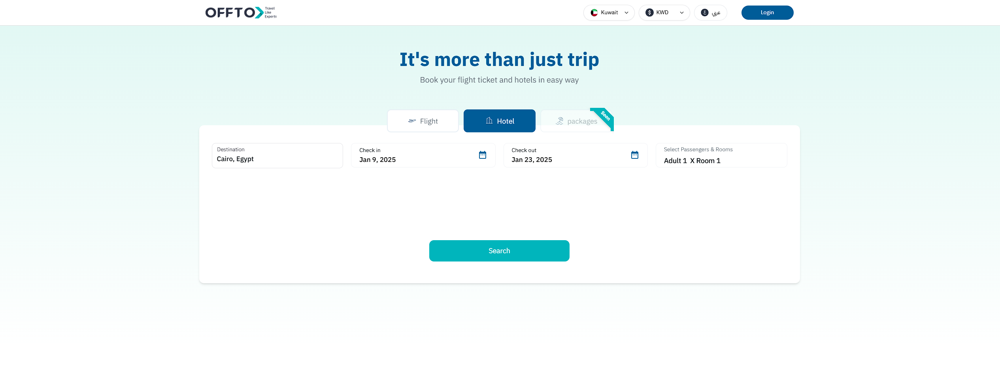
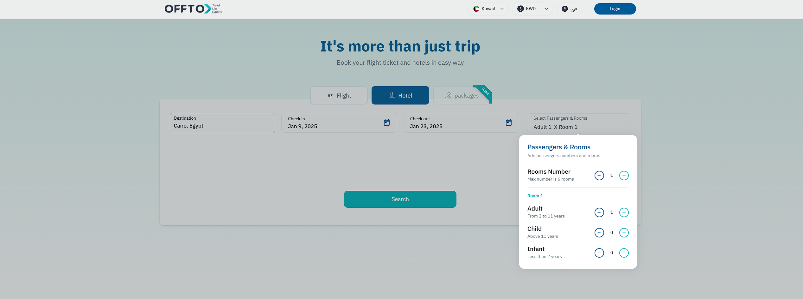

# Senior Frontend Engineer Role task for OFFTO

## Objective:
The task is to build a frontend UI that replicates the provided design and integrates with specific APIs for destinations and hotel search functionality.

---

## Phase 1: Localization and Internationalization

### Requirements:
#### Localization Support
1. **Integration with `next-intl`**
   - Use the [next-intl](https://next-intl.dev/) package to add support for multiple languages.
   - Ensure the project supports at least two languages (e.g., English and Arabic).

2. **Translation Files**
   - Store translations in separate JSON files for each language.
   - Key translations required:
     - UI labels and buttons (e.g., "Destination", "Check-In Date", "Check-Out Date").
     - Error messages.
     - Placeholder texts.

3. **Language Switcher**
   - Add a language switcher dropdown to the top-right corner of the application.
   - Ensure the UI updates dynamically based on the selected language.

4. **Responsive Text Direction**
   - Implement RTL (right-to-left) support for languages like Arabic.

5. **Testing Localization**
   - Verify that all UI components and content adapt correctly to the selected language and direction.

---

## Phase 2: UI and Initial API Integration

### Requirements:
#### UI Components
1. **Destination Input**
   - A text input box where users can type the name of a city.
   - A search button next to it that triggers the destination search API.

2. **Check-In and Check-Out Dates**
   - Two date pickers for selecting the check-in and check-out dates.

3. **Passengers and Rooms Selection**
   - A dropdown that allows users to:
     - Add up to 6 rooms.
     - For each room, specify:
       - Number of adults.
       - Number of children.
       - Ages of children.
       - Number of infants.

4. **Search Button**
   - A button to send the final hotel search request based on user input.

5. **Search Inputs Transition:**
   - After entering the destination, dates, and passenger details, the search inputs will function on a second screen as shown in the design.

6. **Header and Background**
   - Build the header with a language switcher matching the design.
   - Ensure the background includes the linear gradient and text as provided in the screens.

### API Integration
#### Endpoint 1: Get All Cities
- **URL:** `{{base_url}}/get_all_cities`
- **Method:** POST
- **Request Body:**
  ```json
  {
      "search": "name_of_city"
  }
  ```
- **Response:** A list of matching cities.
- **Task:** Use this endpoint to search for cities. When a city is selected, it should populate the "Destination" field.

#### Endpoint 2: Get All Hotels
- **URL:** `{{base_url}}/get_all_hotels?page=1`
- **Method:** POST
- **Request Body Example:**
  ```json
  {
      "DestinationCity": "Dubai",
      "CheckInDate": "2024-04-25",
      "CheckOutDate": "2024-04-29",
      "CountryofResidence": "KW",
      "CountryOfNationality": "KW",
      "Room": [
          {
              "NumberOfAdult": 2,
              "NumberOfChild": 1,
              "AgeOfChild": [9]
          }
      ],
      "currencyCode": "KWD",
      "locale": "en"
  }
  ```
- **Response:** A list of hotels matching the search criteria.
- **Task:** Use this endpoint to fetch the hotel list based on:
  - Selected destination.
  - Check-in and check-out dates.
  - Passengers and room information.

### Functional Requirements
1. **Destination Search**
   - As the user types, make a POST request to the "Get All Cities" endpoint.
   - Display the results in a dropdown.
   - Allow the user to select a city from the dropdown.

2. **Room and Passenger Selection**
   - Implement functionality to add up to 6 rooms.
   - For each room:
     - Allow the user to select the number of adults, children, and infants.
     - If children are added, prompt the user to input their ages.

3. **Search Functionality**
   - Gather all inputs (destination, check-in and check-out dates, rooms, and passengers).
   - Construct a POST request to the "Get All Hotels" endpoint.
   - Display the list of hotels returned in the response.

4. **Design Consistency**
   - Ensure the UI components match the design provided in the attached screens.

---

## Deliverables
1. Source code for the UI.
2. A working prototype of the interface.
3. README file with setup instructions and any assumptions made.

---

## Evaluation Criteria
- UI similarity to the design.
- Proper integration with APIs.
- Code structure and readability.
- Handling edge cases and errors.
- Clear documentation.


## Screens





