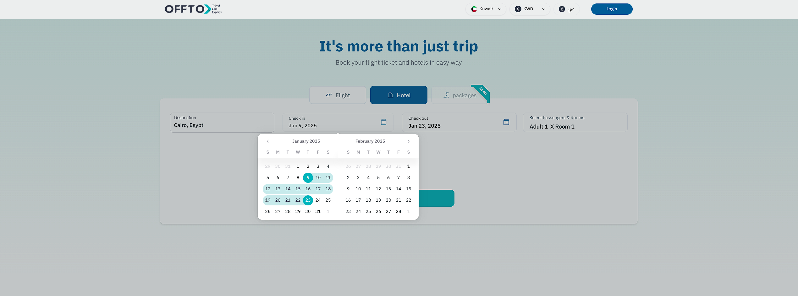
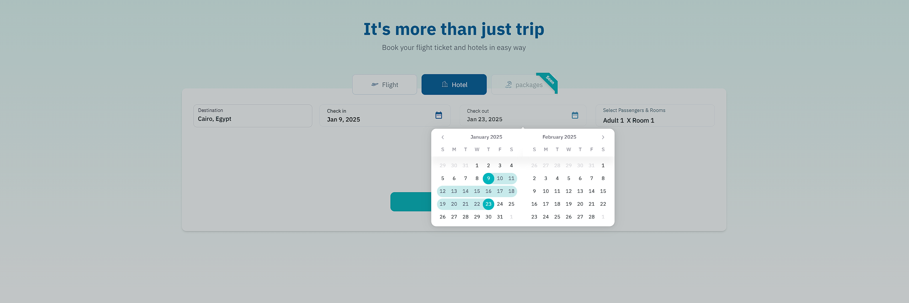

# Senior Frontend Developer Task for OffTo

## Objective:
The task is to build a frontend UI that replicates the provided design and integrates with specific APIs for destinations and hotel search functionality.

---

## Phase 1: Localization and Internationalization

### Requirements:
#### Localization Support
1. **Integration with `next-intl`**
   - Use the [next-intl](https://next-intl.dev/) package to add support for multiple languages.
   - Ensure the project supports at least two languages (e.g., English and Arabic).

2. **Translation Files**
   - Store translations in separate JSON files for each language.
   - Key translations required:
     - UI labels and buttons (e.g., "Destination", "Check-In Date", "Check-Out Date").
     - Error messages.
     - Placeholder texts.

3. **Language Switcher**
   - Add a language switcher dropdown to the top-right corner of the application.
   - Ensure the UI updates dynamically based on the selected language.

4. **Responsive Text Direction**
   - Implement RTL (right-to-left) support for languages like Arabic.

5. **Testing Localization**
   - Verify that all UI components and content adapt correctly to the selected language and direction.

---

## Phase 2: UI and Initial API Integration

### Requirements:
#### UI Components
1. **Destination Input**
   - A text input box where users can type the name of a city.
   - A search button next to it that triggers the destination search API.

2. **Check-In and Check-Out Dates**
   - Two date pickers for selecting the check-in and check-out dates.

3. **Passengers and Rooms Selection**
   - A dropdown that allows users to:
     - Add up to 6 rooms.
     - For each room, specify:
       - Number of adults.
       - Number of children.
       - Ages of children.
       - Number of infants.

4. **Search Button**
   - A button to send the final hotel search request based on user input.

5. **Search Inputs Transition:**
   - After entering the destination, dates, and passenger details, the search inputs will function on a second screen as shown in the design.

6. **Header and Background**
   - Build the header with a language switcher matching the design.
   - Ensure the background includes the linear gradient and text as provided in the screens.

### API Integration
#### Endpoint 1: Get All Cities
- **URL:** `{{base_url}}/get_all_cities`
- **Method:** POST
- **Request Body:**
  ```json
  {
      "search": "name_of_city"
  }
  ```
- **Response:** A list of matching cities.
- **Task:** Use this endpoint to search for cities. When a city is selected, it should populate the "Destination" field.

#### Endpoint 2: Get All Hotels
- **URL:** `{{base_url}}/get_all_hotels?page=1`
- **Method:** POST
- **Request Body Example:**
  ```json
  {
      "DestinationCity": "Dubai",
      "CheckInDate": "2024-04-25",
      "CheckOutDate": "2024-04-29",
      "CountryofResidence": "KW",
      "CountryOfNationality": "KW",
      "Room": [
          {
              "NumberOfAdult": 2,
              "NumberOfChild": 1,
              "AgeOfChild": [9]
          }
      ],
      "currencyCode": "KWD",
      "locale": "en"
  }
  ```
- **Response:** A list of hotels matching the search criteria.
- **Task:** Use this endpoint to fetch the hotel list based on:
  - Selected destination.
  - Check-in and check-out dates.
  - Passengers and room information.

### Functional Requirements
1. **Destination Search**
   - As the user types, make a POST request to the "Get All Cities" endpoint.
   - Display the results in a dropdown.
   - Allow the user to select a city from the dropdown.

2. **Room and Passenger Selection**
   - Implement functionality to add up to 6 rooms.
   - For each room:
     - Allow the user to select the number of adults, children, and infants.
     - If children are added, prompt the user to input their ages.

3. **Search Functionality**
   - Gather all inputs (destination, check-in and check-out dates, rooms, and passengers).
   - Construct a POST request to the "Get All Hotels" endpoint.
   - Display the list of hotels returned in the response.

4. **Design Consistency**
   - Ensure the UI components match the design provided in the attached screens.

---

## Phase 3: Hotel List and Infinite Scrolling

### Requirements:
#### UI Components
1. **Hotel List Display**
   - The hotel details should be displayed in a list format.
   - Implement infinite scrolling to load additional hotel results as the user scrolls down.

2. **Skeleton Loader**
   - Initially, display a skeleton loader to indicate that the data is loading, similar to the provided design.

3. **Hotel Details**
   - The first request should display mock hotel details, including:
     - Hotel name.
     - Hotel image.
     - Distance from the center and location (spaced as shown in the design).
     - Include `isDummy: true` in the request body to fetch dummy data while waiting for the actual data.
     - Ensure no duplicate hotels are displayed in the list.
   - After the second request, update the list to include the price returned by the response.

### API Integration
#### First Request: Mock Hotel Details
- **Task:** Display mock hotel data while waiting for the second request to fetch actual details.
- **Request Body Example:**
  ```json
  {
      "DestinationCity": "Dubai",
      "CheckInDate": "2024-04-25",
      "CheckOutDate": "2024-04-29",
      "CountryofResidence": "KW",
      "CountryOfNationality": "KW",
      "Room": [
          {
              "NumberOfAdult": 2,
              "NumberOfChild": 1,
              "AgeOfChild": [9]
          }
      ],
      "currencyCode": "KWD",
      "locale": "en",
      "isDummy": true
  }
  ```

#### Second Request: Hotel Prices
- **URL:** `{{base_url}}/get_all_hotels?page=1`
- **Method:** POST
- **Request Body Example:**
  ```json
  {
      "DestinationCity": "Dubai",
      "CheckInDate": "2024-04-25",
      "CheckOutDate": "2024-04-29",
      "CountryofResidence": "KW",
      "CountryOfNationality": "KW",
      "Room": [
          {
              "NumberOfAdult": 2,
              "NumberOfChild": 1,
              "AgeOfChild": [9]
          }
      ],
      "currencyCode": "KWD",
      "locale": "en"
  }
  ```
- **Response:** Actual hotel data, including prices.

### Functional Requirements
1. **Skeleton Loader**
   - Show a skeleton loader immediately after the user submits the search request.

2. **Infinite Scrolling**
   - Load and display additional hotels when the user scrolls to the bottom of the list.

3. **Update Hotel List**
   - Replace mock data with actual hotel data from the second request.

4. **Prevent Duplicate Hotels**
   - Ensure that no hotel appears multiple times in the list.

---

## UI Details
1. **Hotel Name and Image**
   - Ensure sufficient spacing between the hotel name, image, location, and distance from the center.

2. **Price Display**
   - Display prices fetched from the second request prominently below the hotel name.

3. **Design Consistency**
   - Match the provided design closely for both the skeleton loader and final hotel details display.

4. **Screens Provided**
   - The screens included in the design provide guidance for the following:
     - Header with a language switcher.
     - Linear gradient background with accompanying text.
     - Proper alignment of components to match the design.

---

## Notes for Candidates
- **Styling:** Maintain a professional and clean design consistent with the provided UI.
- **Error Handling:**
  - Validate inputs before making API calls.
  - Display user-friendly error messages for API failures.
- **Documentation:** Include a README file explaining how to run your solution.
  - Ensure you follow the repository's project structure.
  - The repository contains examples of API requests, types, and project structure.
  - Utilize `next-ui` with Tailwind CSS for styling and integrate built-in functions in the `fetch` folder, leveraging React Query for data fetching and state management.

---

## Deliverables
1. Source code for the UI.
2. A working prototype of the interface.
3. README file with setup instructions and any assumptions made.

---

## Evaluation Criteria
- UI similarity to the design.
- Proper integration with APIs.
- Code structure and readability.
- Handling edge cases and errors.
- Clear documentation.


## Screens






